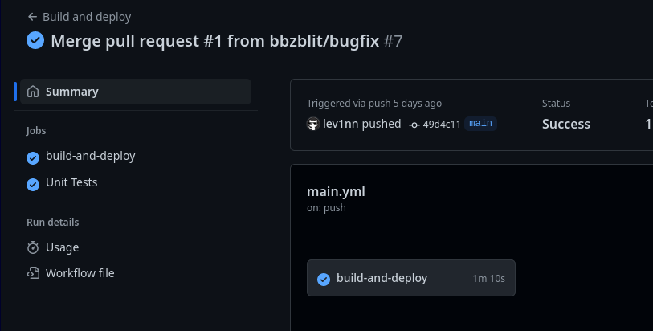
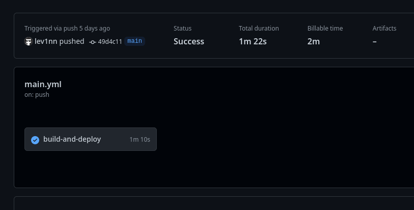

# Getting startet using GitHub Runners

- [Getting startet using GitHub Runners](#getting-startet-using-github-runners)
  - [Einführung](#einführung)
  - [Github Actions Basics](#github-actions-basics)
    - [1. name](#1-name)
    - [2. on](#2-on)
    - [3. jobs](#3-jobs)
    - [4. name](#4-name)
    - [5. runs-on](#5-runs-on)
    - [6. steps](#6-steps)
    - [7. name](#7-name)
  - [8. run](#8-run)
  - [Github predefined Actions](#github-predefined-actions)
    - [1. uses](#1-uses)
    - [2. with](#2-with)
    - [Marketplace](#marketplace)


## Einführung

GitHub runners sind vordefiniert Scripts, die auf einem GitHub Server ausgeführt werden können. Diese können für verschiedene Zwecke verwendet werden. Zum Beispiel um automatisiert Tests durchzuführen oder um automatisiert eine neue Version einer Software zu releasen.

Github runners werden immer aufgrund einer bestimmten Aktion getriggert. Beispiel dafür wäre ein Push auf einen bestimmten Branch oder auch eine Pull Request.

Das Prinzip hinter GitHub actions gibt es auch bei anderen Anbietern. Zum Beispiel bei GitLab oder auch bei Bitbucket _(Trash)_.


## Github Actions Basics

GitHub Actions werden anhand eines YAML-Files definiert. Dieses File muss im Ordner `.github/workflows` abgelegt werden. In diesem Ordner können beliebig viele YAML-Files abgelegt werden. Diese werden dann alle ausgeführt, wenn die entsprechende Aktion getriggert wird. 

Ein Beispiel für ein solches YAML-File ist folgendes:

```yaml
name: Hello World # 1
on: [push] # 2

jobs:
  build: # 3    
    name: Hello world action # 4 
    runs-on: ubuntu-latest  # 5
    steps: # 6
      - name: Hello world  # 7
        run: echo "Hello world!" # 8
```

### 1. name
Der Name, welcher in der UI angezeigt wird. Er hat keine Auswirkung auf die Ausführung. 
Der Name ist am Ende in der UI zu sehen. Man kann so z.B. schnell sehen, welcher Workflow nicht funktioniert hat.



### 2. on
Definiert, wann der Workflow ausgeführt werden soll. In diesem Fall wird der Workflow ausgeführt, wenn ein Push gemacht wird. Es können auch mehrere Aktionen definiert werden. Zum Beispiel `on: [push, pull_request]`


### 3. jobs
Ein Workflow kann aus mehreren Jobs bestehen. Diese werden parallel ausgeführt. In diesem Beispiel gibt es nur einen Job. Dieser hat den Namen `build`. Dieser Name wird in der UI angezeigt.
Jobs können auch abhängig voneinander gemacht werden. Zum Beispiel kann ein Job erst ausgeführt werden, wenn ein anderer Job erfolgreich abgeschlossen wurde.
Zudem können verschiedene Jobs auch auf unterschiedlichen Server ausgeführt werden. So kann eine App z.B. einmal für das Linux und einmal für das Windows Betriebssystem gebaut werden. 

### 4. name
Name des Jobs. Dieser wird in der UI angezeigt.
Kann z.B. dann sinvoll sein, wenn man mehrere Jobs hat, um schnell zu sehen, welcher Job nicht funktioniert hat.



### 5. runs-on
Definiert auf welchem Server der Job ausgeführt werden soll. In diesem Fall wird der Job auf einem Ubuntu Server ausgeführt. Es gibt auch noch andere Server zur Auswahl. Zum Beispiel Windows (`windows-latest`) oder MacOS (`macos-latest`).

**Wichtig**


Jobs werden anhand dem Server abgerechnet, auf dem sie laufen. Sprich: ein Job der auf einem Windows Server läuft, kostet mehr als ein Job der auf einem Linux Server läuft.

Die Formel dafür lautet

|Os | Preis pro Minute |
|---|------------------|
|Linux| 0.008 USD|
|Windows| 0.016 USD|
|MacOS| 0.08 USD|

Pro monat kann man kostenlos für `16$` GitHub actions benutzen. Opensource Projekte (Projekte mit einer visability von **`public`**) bezahlen gar nichts.

### 6. steps
Ein Job besteht aus mehreren Schritten. Diese werden nacheinander ausgeführt. In diesem Fall gibt es nur einen Schritt. Dieser hat den Namen `Hello world`. Dieser Name wird in der UI angezeigt.

Grundsätzlich sollte man für jede neue Funktion einen einzelnen Step definieren. Z.B. einen Step für das Bauen der App und einen Step für das Deployen der App.

So kann man besser herausfinden, welcher Step nicht funktioniert hat. Es würde allerdings auch funktionieren, wenn man alle Schritte in einem Step definiert.

### 7. name
Name des Schrittes. Dieser wird in der UI angezeigt.

## 8. run
Definiert was der Schritt machen soll. In diesem Fall wird einfach nur `Hello world!` ausgegeben. 
Es können auch mehrere Befehle ausgeführt werden.

```yaml
steps:
  - name: Hello world
    run: |
      echo "Hello world!"
      echo "The time is now ${{ steps.step1.outputs.time }}"
```

## Github predefined Actions

Viele Pipelines sind sehr ähnlich. Häuffig wird z.B. in einer Pipeline ein Docker Image gebaut und dieses dann auf einen Server deployed. 

Nun könnte man natürlich jedes Mal eine neue Pipeline in einem neuen Projekt schrieben. 
Um das zu vereinfachen gibt es bereits vordefinierte Pipeline steps. Diese können dann einfach in der Pipeline verwendet werden.

Möchte man z.B. ein Dockerimage bauen und deployen könnte man das nun händisch mit Docker commands machen. Dies wäre allerdings relative zeitaufwändig und auch nicht notwendig. Denn dafür gibt es bereits eine predefined Action von Docker [docker/login-action@v2](https://github.com/marketplace/actions/docker-setup-qemu)

Diese action kann man dazu verwenden, um sich in einen Docker Hub einzuloggen (in diesem Fall der interne Hub von Github).

Diese Action kann nun in einer Pipeline anstelle des `run` Steps verwendet werden.

```yaml
steps:
  - name: Login to Docker Hub
    uses: docker/login-action@v2 # 1
    with: # 2
      username: ${{ secrets.DOCKER_USERNAME }}
      password: ${{ secrets.DOCKER_PASSWORD }}
```

### 1. uses
`uses` wird anstelle von `run` verwendet. Sie definiert welche Action verwendet werden soll. In diesem Fall die Action `docker/login-action@v2`.

### 2. with
Definiert die Parameter für die Action. In diesem Fall den Username und das Passwort für den Docker Hub. Diese werden aus den Secrets gelesen. Secrets sind Variablen, die in der UI definiert werden können. Diese sind dann nur in der Pipeline verfügbar. So können z.B. Passwörter sicher gespeichert werden.


### Marketplace
Weitere predefined Actions können im [Marketplace](
    https://github.com/marketplace/actions/)
gefunden werden.